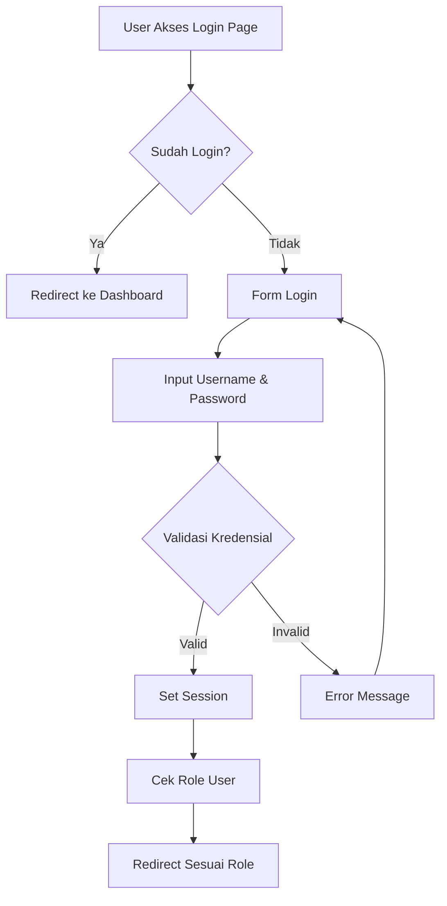
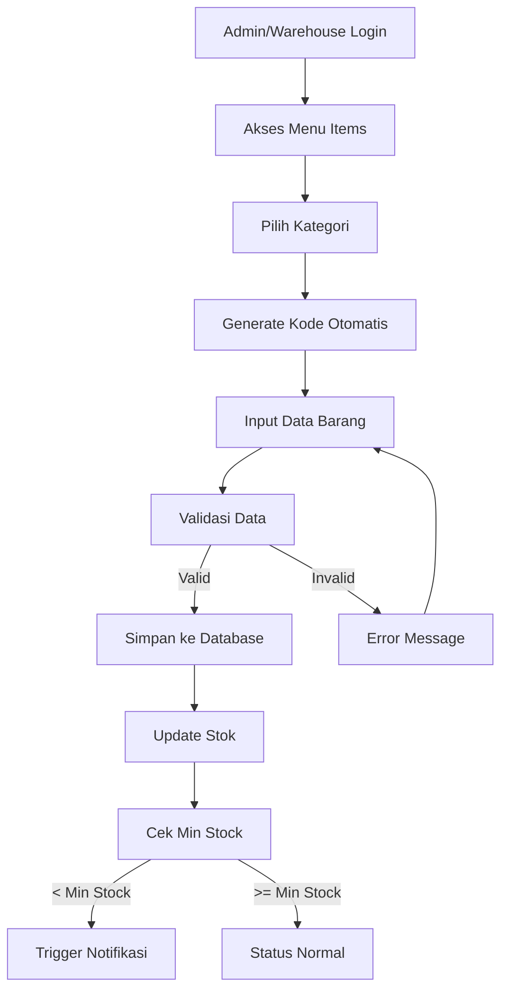
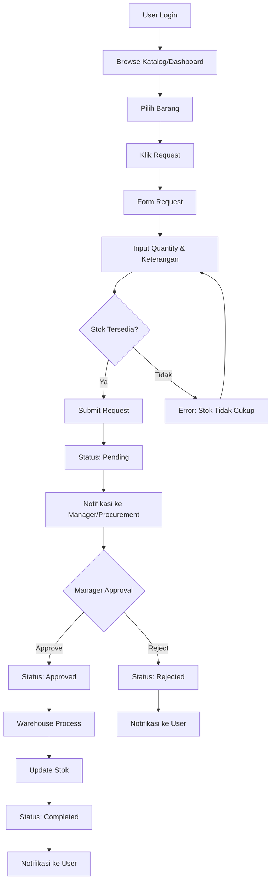
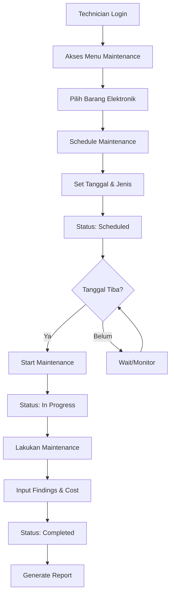
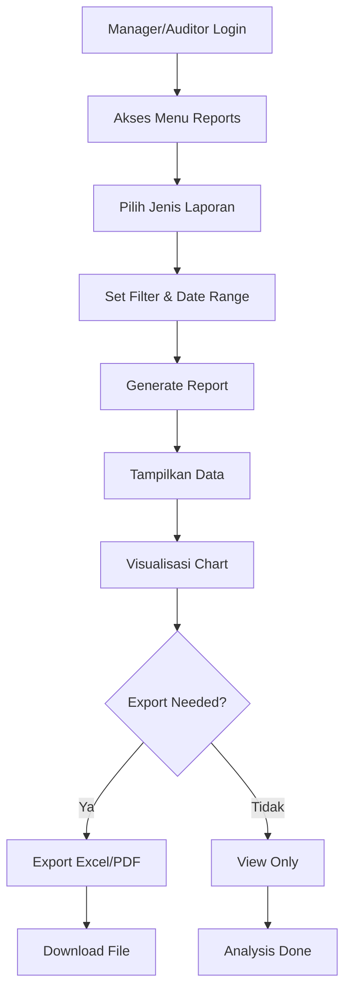
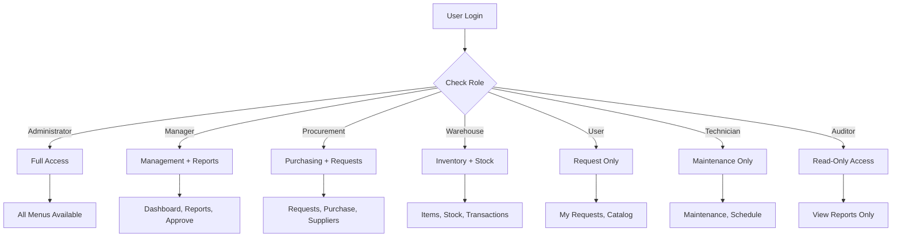
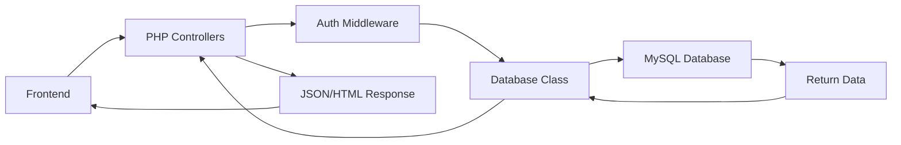
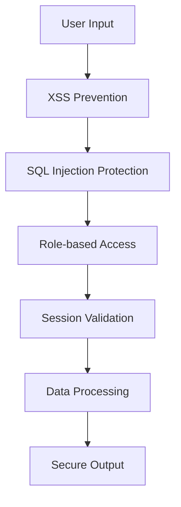

# 📦 Sistem Inventory Sekolah

Sistem manajemen inventori sekolah yang modern dan terintegrasi untuk mengelola aset dan barang sekolah dengan efisien.

## 🚀 Fitur Utama

### 📋 Manajemen Barang
- ✅ CRUD barang dengan kode otomatis berdasarkan kategori
- ✅ Tracking stok real-time dengan notifikasi stok menipis
- ✅ Manajemen kategori dan lokasi barang
- ✅ Upload dan manajemen foto barang

### 👥 Multi-User System (7 Role)
- **Administrator** - Kontrol penuh sistem
- **Manager** - Kelola dan laporan strategis
- **Procurement** - Manajemen pengadaan
- **Warehouse** - Kelola gudang dan stok
- **User** - Ajukan permintaan barang
- **Technician** - Maintenance dan perbaikan
- **Auditor** - Akses read-only untuk audit

### 📊 Laporan & Analytics
- Dashboard interaktif dengan grafik Chart.js
- Laporan stok menipis dan barang habis
- Laporan maintenance barang elektronik
- Export ke Excel dan Print-friendly
- Trend analysis bulanan

### 🔧 Sistem Maintenance
- Jadwal maintenance preventif
- Tracking status: Scheduled → In Progress → Completed
- Riwayat maintenance dengan biaya
- Notifikasi maintenance terlambat

### 📝 Workflow Permintaan
- Sistem approval berlapis
- Tracking status permintaan real-time
- Notifikasi untuk approver
- History lengkap permintaan

## 📋 Alur Kerja Aplikasi

### 🔐 1. Authentication & Authorization Flow



### 📦 2. Manajemen Barang Workflow



### 🛒 3. Request Barang Workflow



### 🔧 4. Maintenance Workflow



### 📊 5. Reporting & Analytics Workflow



### 🏢 6. Multi-User Role Access Flow



## 📊 Sistem Notifikasi

### 🔔 Real-time Notifications

1. **Stok Menipis** (quantity ≤ min_stock)
   - Target: Warehouse, Manager, Procurement
   - Trigger: Setiap transaksi keluar
   - Action: Purchase request

2. **Request Pending** 
   - Target: Manager, Procurement
   - Trigger: User submit request
   - Action: Approve/Reject

3. **Maintenance Overdue**
   - Target: Technician, Manager
   - Trigger: Scheduled date passed
   - Action: Urgent maintenance

4. **Request Status Update**
   - Target: Requester
   - Trigger: Status change
   - Action: Information

## 🔄 Data Flow Architecture

### Database Interaction Flow



### Security Flow



## 🛠️ Teknologi Stack

- **Backend**: PHP 8.0+ dengan PDO
- **Database**: MySQL/MariaDB
- **Frontend**: HTML5, CSS3, JavaScript ES6
- **UI Framework**: Custom CSS dengan Font Awesome
- **Charts**: Chart.js untuk visualisasi data
- **Export**: SheetJS untuk export Excel

## 📋 Persyaratan Sistem

- PHP >= 8.0
- MySQL/MariaDB >= 5.7
- Apache/Nginx Web Server
- XAMPP/WAMP (untuk development)

## ⚡ Quick Start

### 1. Clone & Setup
```bash
# Clone ke folder xampp/htdocs
git clone [repository-url] inventory-sekolah
cd inventory-sekolah
```

### 2. Database Setup
```sql
-- Import struktur database
mysql -u root -p < database/inventory_sekolah.sql
```

### 3. Konfigurasi Database
```php
// config/database.php
private $host = "localhost";
private $db_name = "inventory_sekolah";
private $username = "root";
private $password = "";
```

### 4. Perbaiki Password Demo
```bash
# Akses melalui browser
http://localhost/inventory-sekolah/fix_passwords.php
```

### 5. Login
```bash
# Akses sistem
http://localhost/inventory-sekolah/login.php
```

## 👤 Akun Demo

| Role | Username | Password | Akses |
|------|----------|----------|-------|
| Administrator | `admin` | `admin123` | Semua fitur |
| Manager | `manager` | `manager123` | Laporan & analitik |
| Warehouse | `warehouse` | `warehouse123` | Kelola barang |
| Technician | `technician` | `tech123` | Maintenance |
| User | `user` | `user123` | Permintaan barang |

## 📁 Struktur Project

```
inventory-sekolah/
├── 📁 assets/
│   ├── 📁 css/
│   │   ├── style.css          # Main stylesheet
│   │   ├── sidebar.css        # Sidebar components
│   │   └── additional.css     # Additional styles
│   ├── 📁 js/
│   │   ├── main.js           # Core JavaScript
│   │   ├── sidebar.js        # Sidebar functionality
│   │   └── items.js          # Items management
│   └── 📁 uploads/           # Upload directory
├── 📁 config/
│   ├── auth.php              # Authentication class
│   ├── database.php          # Database connection
│   └── item_code_generator.php # Auto item code
├── 📁 pages/
│   ├── dashboard.php         # Main dashboard
│   ├── items.php            # Items management
│   ├── categories.php       # Categories
│   ├── transactions.php     # Transactions
│   ├── requests.php         # Request management
│   ├── maintenance.php      # Maintenance system
│   ├── reports.php          # Reports & analytics
│   ├── users.php           # User management
│   └── catalog.php         # Public catalog
├── 📁 database/
│   └── inventory_sekolah.sql # Database structure
├── login.php               # Login page
├── index.php              # Landing page
├── fix_passwords.php      # Password utility
├── debug_login.php        # Debug utility
└── README.md              # Documentation
```

## 🎯 Fitur Unggulan

### 🏷️ Auto Item Code Generation
Sistem otomatis generate kode barang berdasarkan kategori:
- **OLR**#### - Olahraga (OLR0001, OLR0002, ...)
- **ELK**#### - Elektronik (ELK0001, ELK0002, ...)
- **FUR**#### - Furnitur (FUR0001, FUR0002, ...)
- **LAB**#### - Laboratorium (LAB0001, LAB0002, ...)
- **ATK**#### - Alat Tulis (ATK0001, ATK0002, ...)
- **KBR**#### - Kebersihan (KBR0001, KBR0002, ...)

### 🔔 Smart Notifications
- **Stok Menipis/Habis**: Alert otomatis saat stok ≤ minimum
- **Maintenance Terlambat**: Notifikasi maintenance overdue
- **Permintaan Pending**: Alert untuk approval yang tertunda
- **Request Status**: Update status ke requester

### 📱 Responsive Design
- **Mobile-first approach**: Optimized untuk mobile
- **Sidebar minimizable**: Dapat dikecilkan untuk efisiensi space
- **Touch-friendly interface**: Mudah digunakan di touchscreen
- **Cross-browser compatibility**: Support semua browser modern

### 🔐 Security Features
- **Password hashing**: Menggunakan PHP password_hash()
- **Role-based access control**: Pembatasan akses per role
- **SQL injection protection**: Prepared statements
- **XSS prevention**: HTML escaping
- **Session management**: Secure session handling

## 📊 Database Schema

### Tabel Utama
- `users` - Data pengguna dan role
- `roles` - Definisi role/peran
- `categories` - Kategori barang
- `items` - Master data barang
- `transactions` - Transaksi masuk/keluar
- `requests` - Permintaan barang
- `maintenance` - Data maintenance

### Relationship Schema
```sql
users ←→ roles (many-to-one)
    ↓
requests (one-to-many)

items ←→ categories (many-to-one)
    ↓
transactions (one-to-many)
    ↓
maintenance (one-to-many)

requests ←→ items (many-to-one)
```

## 🔄 Business Process Flow

### 1. Procurement Process
```
Need Identification → Request Creation → Manager Approval → 
Procurement Process → Goods Receipt → Stock Update → 
Distribution → Usage Tracking
```

### 2. Maintenance Process
```
Asset Registration → Maintenance Schedule → Preventive Action → 
Condition Assessment → Repair/Replace → Cost Recording → 
Performance Analysis
```

### 3. Request Fulfillment
```
User Request → Stock Check → Approval Workflow → 
Item Allocation → Delivery → Confirmation → 
Stock Adjustment
```

## 🎨 UI/UX Features

- **Modern Design** - Clean dan professional interface
- **Interactive Charts** - Real-time data visualization
- **Smooth Animation** - CSS transitions untuk UX yang baik
- **Loading States** - Visual feedback saat loading
- **Dark Theme Ready** - Siap untuk implementasi dark mode
- **Accessibility** - WCAG compliant design

## 🛠️ Development Workflow

### Setup Development Environment
```bash
# 1. Install XAMPP
# 2. Clone repository ke htdocs
# 3. Import database
# 4. Configure database connection
# 5. Run fix_passwords.php
# 6. Test all functionalities
```

### Development Guidelines
1. **Code Structure**: Follow MVC pattern
2. **Security**: Always use prepared statements
3. **UI/UX**: Mobile-first responsive design
4. **Documentation**: Comment complex logic
5. **Testing**: Test all user roles and permissions

## 📝 API Documentation

### Authentication Endpoints
- `POST /login.php` - User authentication
- `GET /config/logout.php` - User logout
- `GET /pages/catalog.php` - Public catalog (no auth required)

### Core Modules
- **Items**: CRUD operations untuk inventory
- **Requests**: Workflow permintaan barang
- **Maintenance**: Scheduling dan tracking maintenance
- **Reports**: Analytics dan reporting
- **Users**: User management (admin only)

## 🚀 Performance Optimization

### Database Optimization
- Index pada foreign keys
- Query optimization dengan EXPLAIN
- Connection pooling
- Regular database maintenance

### Frontend Optimization
- CSS/JS minification
- Image optimization
- Lazy loading untuk tables
- Browser caching

### Security Best Practices
- Regular security updates
- Input validation dan sanitization
- Error handling yang secure
- Audit logs untuk sensitive operations

## 🔧 Customization Guide

### Menambah Role Baru
```sql
-- 1. Insert role baru
INSERT INTO roles (role_name, description) VALUES ('New Role', 'Description');

-- 2. Update auth.php untuk permission checks
// config/auth.php
public function hasRole($roles) {
    return in_array($_SESSION['role_name'], $roles);
}
```

### Menambah Kategori Baru
```php
// 1. Tambah via admin panel atau direct SQL
// 2. Update item_code_generator.php
$categoryCodeMap = [
    'new_category' => 'NEW',
    // ... existing categories
];
```

### Custom Notification
```php
// Implement dalam setiap module yang membutuhkan
function sendNotification($userId, $message, $type) {
    // Database insert atau real-time notification
}
```

## 🐛 Troubleshooting

### Common Issues

#### 1. Login Problems
```bash
# Debug steps:
1. php debug_login.php          # Check database structure
2. php fix_passwords.php        # Reset demo passwords
3. Check error logs             # /xampp/apache/logs/error.log
4. Verify database connection   # config/database.php
```

#### 2. Permission Denied
```php
// Check user role and permissions
if (!$auth->hasRole(['Administrator', 'Manager'])) {
    // Access denied
}
```

#### 3. Database Connection
```php
// Test connection
try {
    $db = new Database();
    $connection = $db->connect();
    echo "✅ Database connected successfully";
} catch(Exception $e) {
    echo "❌ Error: " . $e->getMessage();
}
```

#### 4. File Upload Issues
```bash
# Check PHP settings
upload_max_filesize = 10M
post_max_size = 10M
max_execution_time = 30

# Check directory permissions
chmod 755 assets/uploads/
```

## 📈 Monitoring & Analytics

### Key Metrics to Track
- **Stock Levels**: Current vs minimum stock
- **Request Volume**: Daily/monthly request trends
- **Maintenance Costs**: Budget vs actual spending
- **User Activity**: Login frequency and feature usage
- **System Performance**: Response times and errors

### Built-in Reports
- **Inventory Reports**: Stock levels, low stock alerts
- **Maintenance Reports**: Scheduled, completed, overdue
- **Request Reports**: Pending, approved, rejected
- **Usage Analytics**: Most requested items, peak times

## 🤝 Contributing

### Development Process
1. Fork the project
2. Create feature branch (`git checkout -b feature/AmazingFeature`)
3. Follow coding standards
4. Add tests for new features
5. Update documentation
6. Commit changes (`git commit -m 'Add AmazingFeature'`)
7. Push to branch (`git push origin feature/AmazingFeature`)
8. Open Pull Request

### Code Standards
- **PHP**: Follow PSR-12 coding standards
- **JavaScript**: ES6+ with proper error handling
- **CSS**: BEM methodology for class naming
- **Database**: Proper indexing and normalization

## 📄 License

Distributed under the MIT License. See `LICENSE` for more information.

## 📞 Support & Documentation

- 📧 **Email**: support@inventory-sekolah.com
- 📱 **WhatsApp**: +62-xxx-xxxx-xxxx
- 🌐 **Website**: https://inventory-sekolah.com
- 📚 **Documentation**: https://docs.inventory-sekolah.com
- 🐛 **Bug Reports**: https://github.com/inventory-sekolah/issues
- 💡 **Feature Requests**: https://github.com/inventory-sekolah/discussions

## 🎯 Future Roadmap

### Version 2.0 (Q2 2024)
- [ ] **Mobile Application** - Native iOS/Android app
- [ ] **API REST** - Full REST API implementation
- [ ] **Barcode/QR Scanning** - Physical asset tracking
- [ ] **Advanced Analytics** - AI-powered insights
- [ ] **Multi-branch Support** - Multiple school locations
- [ ] **Integration Hub** - Connect with ERP systems

### Version 1.5 (Q1 2024)
- [ ] **Email Notifications** - SMTP integration
- [ ] **File Attachments** - Document management
- [ ] **Advanced Search** - Elasticsearch integration
- [ ] **Bulk Operations** - Mass data operations
- [ ] **Data Import/Export** - CSV/Excel import
- [ ] **Audit Trails** - Complete activity logging

### Version 1.2 (Current)
- [x] **Auto Item Codes** - Category-based generation
- [x] **Multi-user Roles** - 7 different user types
- [x] **Maintenance System** - Complete maintenance workflow
- [x] **Smart Notifications** - Real-time alerts
- [x] **Responsive Design** - Mobile-optimized interface
- [x] **Advanced Reports** - Charts and analytics

---

**Made with ❤️ for Indonesian Schools**

*Sistem Inventory Sekolah - Modernizing School Asset Management*

> **"Transforming traditional school inventory management into a digital, efficient, and transparent system that empowers educational institutions to focus on what matters most - education."**

---

### 📋 Quick Navigation
- [Installation Guide](#-quick-start)
- [User Manual](#-alur-kerja-aplikasi)
- [Technical Documentation](#-database-schema)
- [Troubleshooting](#-troubleshooting)
- [API Reference](#-api-documentation)
- [Contributing](#-contributing)
